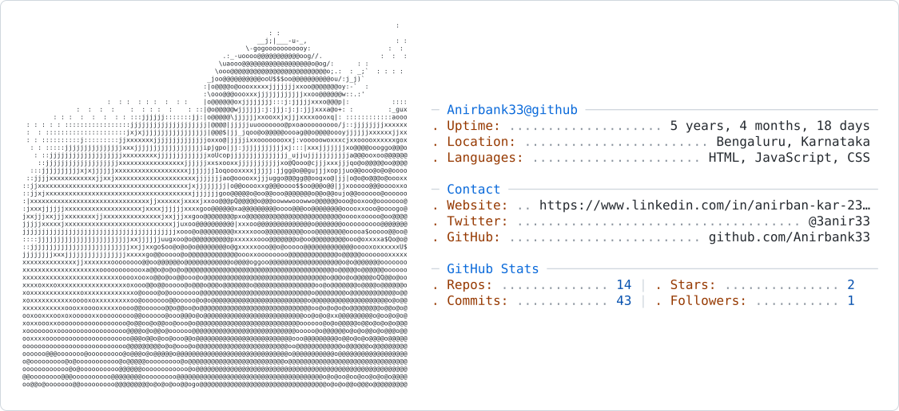

<div align="center">
  <picture>
    <source media="(prefers-color-scheme: dark)" srcset="./dark_mode.svg" />
    
  </picture>
  
  <p>
    
    
    
    
  </p>
  <p>
    <a href="https://github.com/Anirbank33"></a>
    <a href="https://github.com/Anirbank33?tab=repositories"></a>
    <a href="https://www.linkedin.com/in/anirban-kar-23645414a/"></a>
  </p>
</div>

---

**about** · backend developer from Bengaluru — APIs, databases, building daily

```text
building   full-stack & backend projects
learning   java · spring boot · rest apis
exploring  node.js · mongodb · auth · devops
goal       strong backend developer
open to    feedback · collaboration
```

**featured**

| | | |
|:--|:--|:--|
| [Medical Department Tracker](https://github.com/Anirbank33/medical-department-tracker) | React · TS · Express | Ward operations tracker |
| [Profile README Generator](https://github.com/Anirbank33/profile-readme-generator) | JS · HTML · CSS | Create GitHub profiles |
| [Java Core Troubleshooting](https://github.com/Anirbank33/java-core-troubleshooting) | Java | Debugging practice |
| [Backend Demo](https://github.com/Anirbank33/backend-demo) | Node · Express | REST API with client |

**stack**

<div align="left">
  
</div>

**analytics**

<div align="center">
  
  
  
  
</div>

**arcade** · contribution graph game · updates every 12h

<div align="center">
  
</div>

**connect**

<div align="center">
  <a href="https://www.linkedin.com/in/anirban-kar-23645414a/"></a>
  <a href="https://github.com/Anirbank33"></a>
  <a href="mailto:anirbankar23@gmail.com"></a>
  <br/>
  <sub><i>build · break · build again</i></sub>
  &nbsp;·&nbsp;
  
</div>
